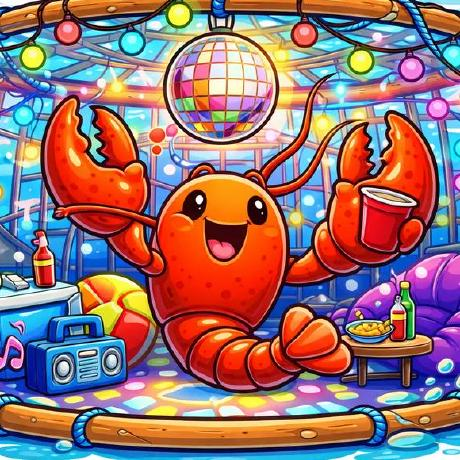

<!-- _class: lead -->
<!-- _paginate: false -->
<!-- _footer: "" -->



# Lola & packaging-skills

**Write AI skills once, share them with your team**

Zach Huntington-Meath

---

# The Problem

Everyone on the team is building AI skills — but in isolation

- Skills live as loose files in `~/.claude/skills/`
- Sharing means copy-pasting files or "hey check out my skill"
- Everyone's version drifts — no single source of truth
- No review process, no updates, no consistency
- New team members start from scratch

**We needed a way to share skills like we share code.**

---

# What is Lola?


**A universal AI context package manager**

- Install skills, commands, agents, and MCP configs with one command
- Works across assistants: Claude Code, Cursor, Gemini CLI, OpenCode
- Federated marketplaces — like repos for dnf
- Declarative with `.lola-req` — your `requirements.txt` for AI context
- Open source (GPL-2.0), Python, `uv tool install lola-ai`

> If a skill were an RPM, Lola is the DNF for it.

---

# Why Lola?

We wanted:

- **One repo** the team can contribute to and pull from
- **One command** to install everything — no manual file copying
- **Version control** — PR reviews for skill changes
- **Consistency** — everyone gets the same skills, same version

Lola gives us all of that.

---

# What's in a Lola Module?

```
my-module/
└── module/
    ├── AGENTS.md            # Module-level instructions
    ├── skills/              # Skills (auto-discovered)
    │   └── my-skill/
    │       ├── SKILL.md     # The skill definition
    │       ├── references/  # Supporting docs for THIS skill
    │       └── scripts/     # Helper scripts for THIS skill
    ├── commands/            # Slash commands (auto-discovered)
    │   └── do-thing.md
    ├── agents/              # Subagents (auto-discovered)
    │   └── helper.md
    └── mcps.json            # MCP server configs
```

No manifest needed — Lola auto-discovers everything from the directory structure.

---

# Design Constraint Worth Knowing

Reference material must live **inside** a skill's directory.

There's no shared `references/` at the module level — each skill is self-contained.

**What this means for design:**
- If two skills need the same context (e.g. "Foreman ecosystem overview"), you either duplicate it or create a dedicated knowledge skill
- Think of skills as independent packages, not parts of a monolith
- Universal knowledge → its own skill (e.g. `packaging-systems-thinker`)
- Tool-specific workflows → tool skill with its own refs (e.g. `obal`)

This keeps skills portable — any skill can be installed alone.

---

# Our Module: packaging-skills

```
packaging-skills/
└── module/
    ├── AGENTS.md
    └── skills/
        └── obal/
            ├── SKILL.md
            ├── references/    # 11 reference docs
            └── scripts/       # Helper scripts
```

**obal** — RPM packaging workflows
- Package updates, spec files, changelog generation
- Mock builds, COPR scratch builds, release builds
- Dependency verification with repoclosure
- Built-in safety guardrails (location checks, release gates)

Coming soon: **packaging-systems-thinker** (ecosystem-level knowledge)

---

<!-- _class: lead -->
<!-- _backgroundColor: #1e3a5f -->
<!-- _color: white -->

# Demo

---

# Add & Install

```bash
# Install lola
uv tool install lola-ai

# Register the module
lola mod add https://github.com/Odilhao/packaging-skills

# Install to Claude Code
lola install packaging-skills -a claude-code

# What did it do?
lola list
```

Skills land in `.claude/skills/obal/` — ready to use immediately.

---

# Using It in foreman-packaging

```bash
cd foreman-packaging/

# Add a .lola-req to the repo root
echo "packaging-skills" > .lola-req

# Sync — installs skills into the project
lola sync
```

Result:

```
foreman-packaging/
├── .lola-req                    # Committed to the repo
├── .claude/skills/obal/         # Installed by lola sync
└── packages/
    └── ...
```

- Installs to **project-level** `.claude/skills/`, not `~/.claude/skills/`
- Clone the repo, run `lola sync` — everyone gets the same skills
- Update changed skills: `lola mod update && lola update`

**Tip:** `lola sync` installs to all detected assistants. To target just Claude Code:

```bash
lola install packaging-skills -a claude-code
```

---

# Key Takeaways

1. **Share skills like code** — one repo, PRs, reviews
2. **One command to install** — `lola sync` and you're done
3. **Skills are self-contained** — design around that
4. **It works today** — `uv tool install lola-ai`

---

# References

- **packaging-skills repo:** [github.com/Odilhao/packaging-skills](https://github.com/Odilhao/packaging-skills)
- **Lola repo:** [github.com/LobsterTrap/lola](https://github.com/LobsterTrap/lola)
- **Lola docs:** [lobstertrap.org/lola](https://lobstertrap.org/lola/)
- **AgentSkills.io spec:** [agentskills.io/specification](https://agentskills.io/specification)

---

<!-- _class: lead -->
<!-- _paginate: false -->
<!-- _footer: "" -->

# Questions?

`lola mod add` your own skills and contribute to packaging-skills
